# Bangkit Capstone Team C22-PS184
## Dermanalyze
This is the final project for Bangkit 2022, about Skin Cancer detection. As one of the requirements for graduation. The goal of this app is to detection the skin of the user, so that the user can know if they get skin cancer or not as soon as possible. Dermanalyze is an android app with the following features : capture the skin image,  with the AI (Image Processing) that we build, the application can show detection skin result, show related information such as nearest skin hospital, and some article about skin cancer.

## 📸 Screenshots  

| Splach | Login | Regis | Info |
|------------|------------|--------------|--------------|
| 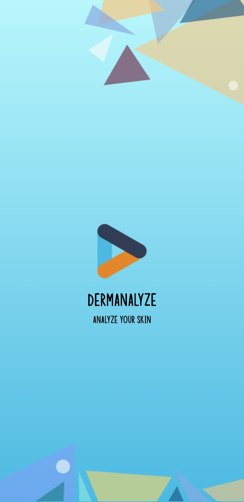 | 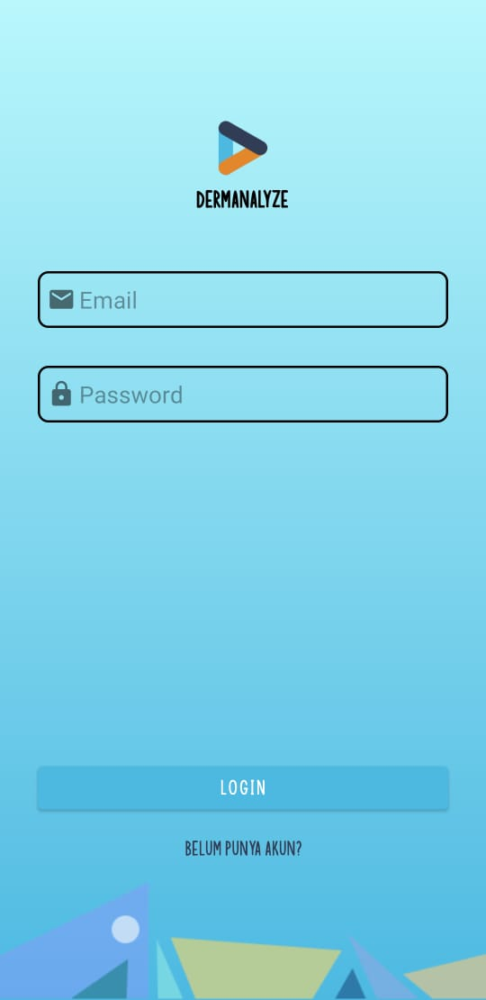 | 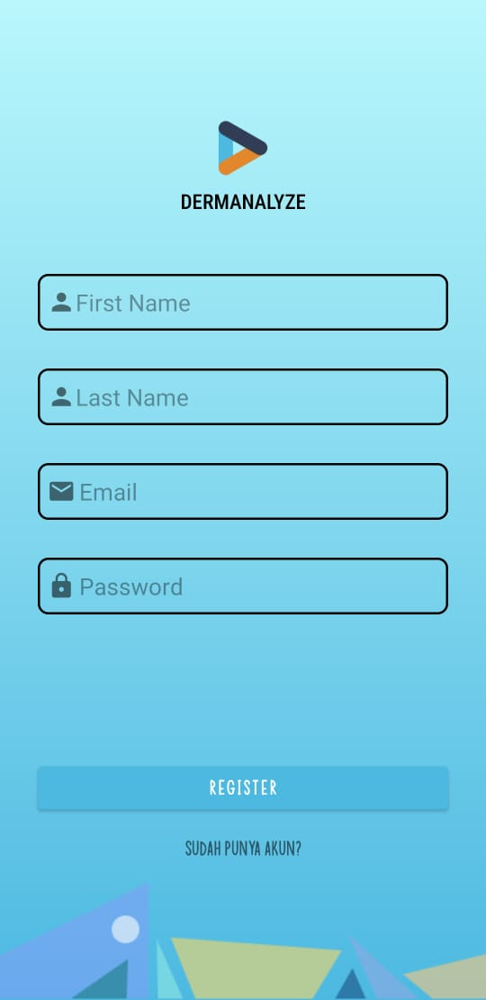 | 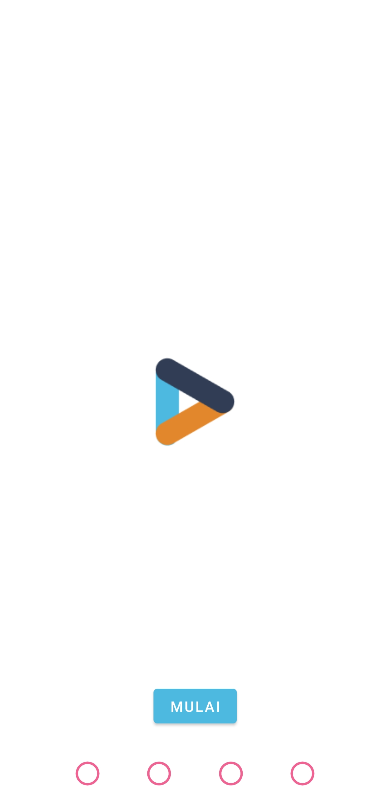 |
| Info | Info | Info | Home |
| 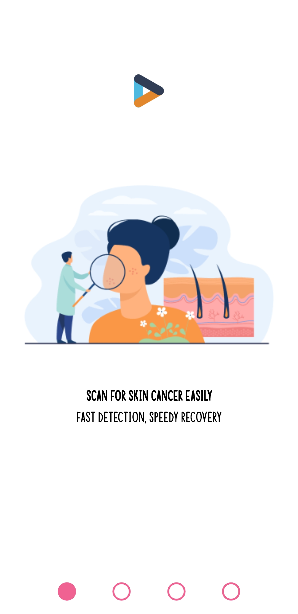 | 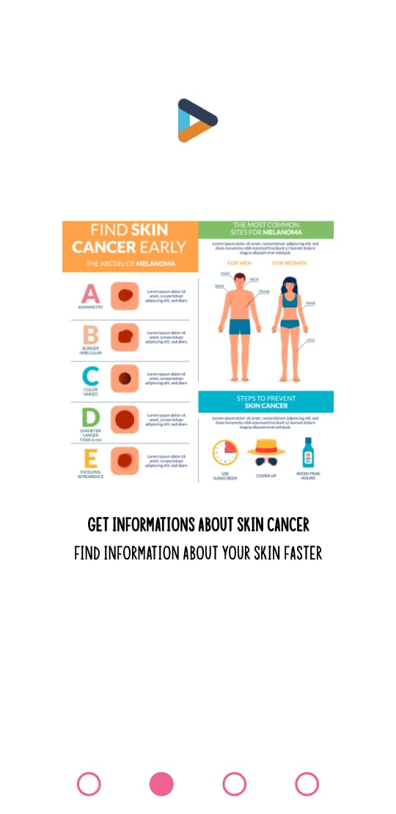 | 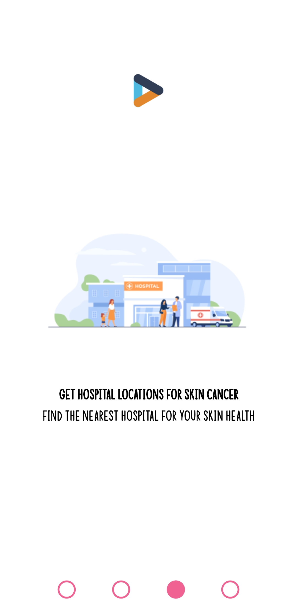 | 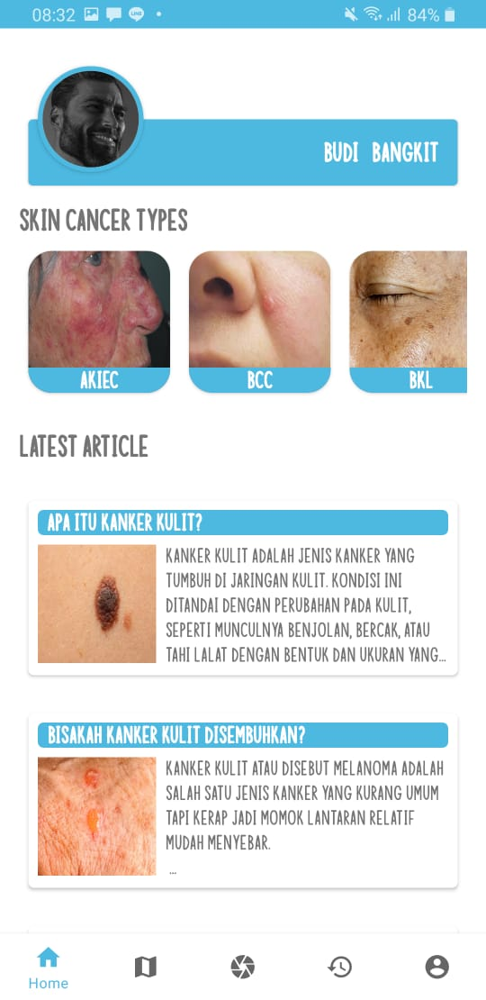 |
| Scan | Result | History | Hospital |
| 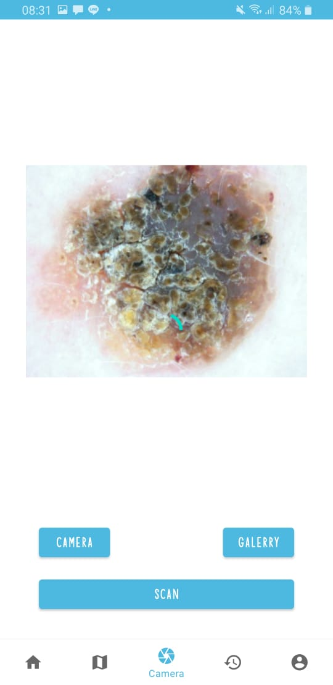 | 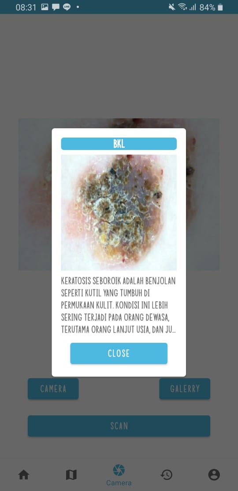 | 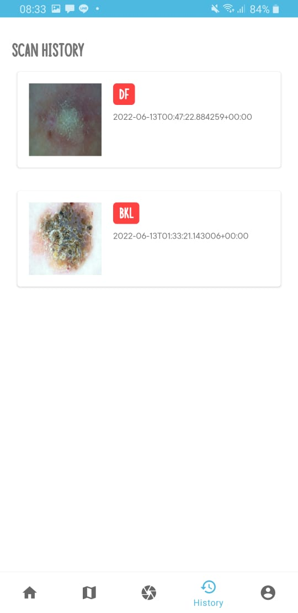 | 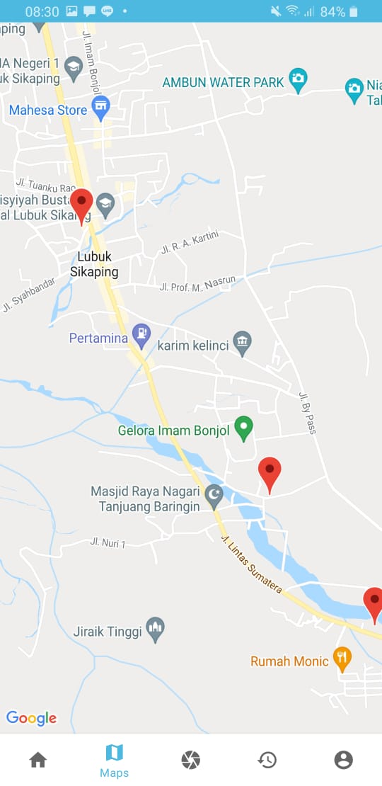 |
| Article | Profile | Setting |  |
| 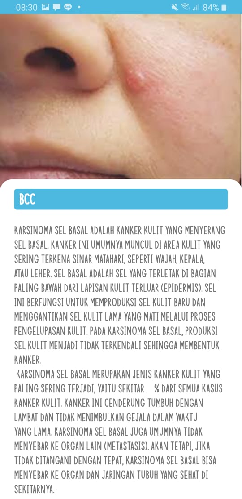 | 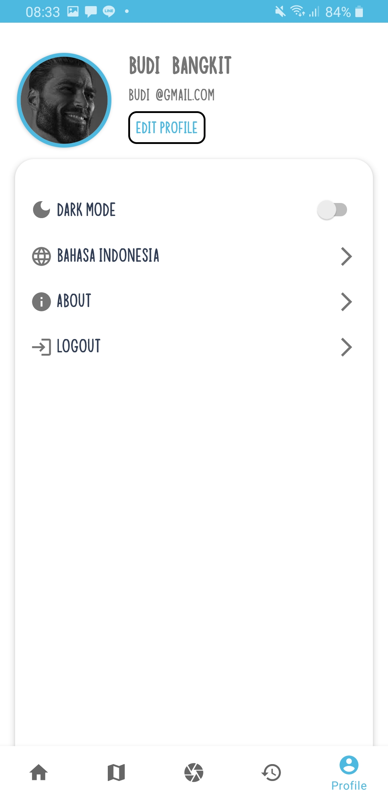 | 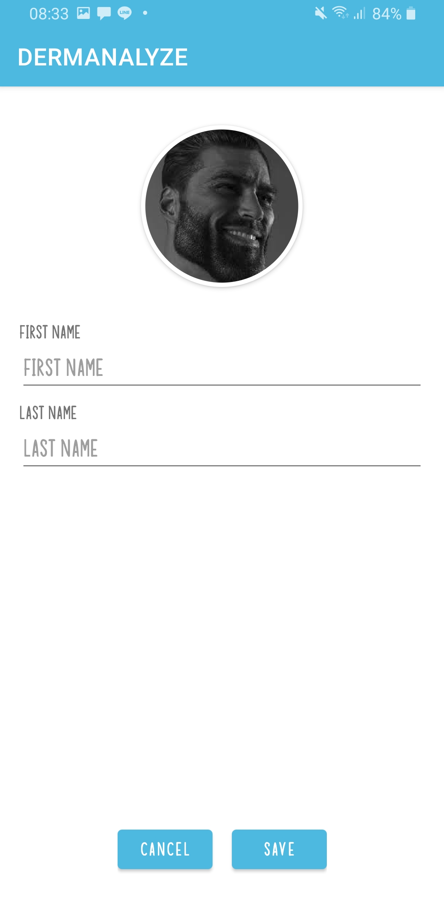 |  |

## Build With

This application build with a few technologies, which are :
- [Android Studio](https://developer.android.com/studio?hl=id&gclid=CjwKCAjwkYGVBhArEiwA4sZLuC3g18Aud6w4gsZ6imqi5lDyvZ3gZWfWA6Uw2tIfjnkZQ9vRdNG7FhoCVvQQAvD_BwE&gclsrc=aw.ds)
- [Kotlin](https://kotlinlang.org/docs/typecasts.html#type-erasure-and-generic-type-checks)
- [Google Maps Api](https://console.cloud.google.com/home/dashboard?project=seraphic-beacon-283014)
- [Python](https://www.python.org/downloads/)
- [FastApi](https://fastapi.tiangolo.com/)
- [PostgreSQL](https://www.postgresql.org/)
- [Jupyter Notebook](https://jupyter.org/)

# Member
- [Aulia Eka Putri Aryani (M7004F0302) - Machine Learning - Institut Teknologi Sepuluh Nopember](https://www.linkedin.com/in/auliaaepa/)
- [Nur Hidayati (M7004F0296) - Machine Learning - Institut Teknologi Sepuluh Nopember](https://www.linkedin.com/in/nur-hidayati-77228518a/)
- [M. Zaki Harits Burnama (A2319F2785) - Mobile Development - Universitas Sumatera Utara](https://www.linkedin.com/in/zaki-burnama/)
- [Wahyu Francesco Toldo Hutabarat (A2319F2777) - Mobile Development - Universitas Sumatera Utara](https://www.linkedin.com/in/wahyu-francesco-toldo-hutabarat-767194195/)
- [Naafi Mahendra (C2319F2781) - Cloud Computing - Universitas Sumatera Utara](https://www.linkedin.com/in/naafi-mahendra/)
- [Mohamad Ichsan Wibawa (C2441W3038) - Cloud Computing - Universitas Islam Negeri Maulana Malik Ibrahim Malang](https://www.linkedin.com/in/ichsanwibawa/)

# Project link
* [Github CC](https://github.com/dha-lang/dermanalyze-api)
* [Github ML](https://github.com/auliaaepa/Dermanalyze-ML) 
* [Figma Design](https://www.figma.com/file/G5GIvFFwimD7WChTruqgDD/Dermanalyze?node-id=0%3A1)

## Features
- Login and Register
- Show an article about Skin Cancer and about types of skincancer
- Show nearby hospital
- Detection Skin cancer
- Show recently skin cancer detection
- Edit Profile.
